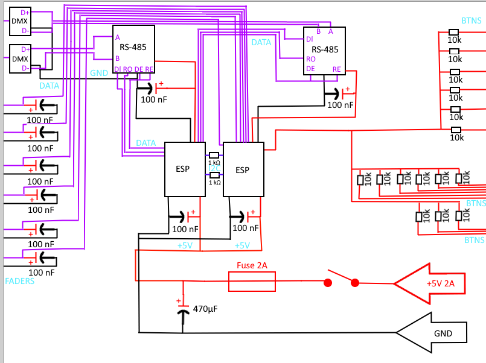

**DMX EASY**
DIY DMX lighting controller based on ESP32, featuring 6 faders, 53 buttons and a custom 3D-printed enclosure.
I made this project because I need an DMX Table but its so expensive

## Overview
Features:
- 6 channel faders
- 53 programmable buttons
- DMX512 output
- Dual ESP32 architecture
- 3D printable enclosure
- Low-cost and easily reproducible design

## Hardware
See the BOM in [bom.csv](BOM.csv) or at the end of file

## Recap:
**Case:**

**Assembly**

**Scheme:**

**Script**
[Here script files](dev/ESP/ESP_DMX/DMX_Controller/DMX_Controller.ino)

**Files**
[Case](assets\DMXEasy.step)
[Case Bottom](assets\BottomDMXEasy.step)
[Assembly](assets\AssemblageDMXEasy.step)
[Scheme](assets\scheme.pdn)

## BOM
| Catégorie  | Article                                     | Quantité | Prix unitaire (€) | Prix total (€) | Notes                                          | URL                                                                                                          |
| ---------- | ------------------------------------------- | -------: | ----------------: | -------------: | ---------------------------------------------- | ------------------------------------------------------------------------------------------------------------ |
| Controls   | Fader                                       |        6 |              1.50 |           9.00 |                                                | [https://fr.aliexpress.com/item/1005006152089336.html](https://fr.aliexpress.com/item/1005006152089336.html) |
| Controls   | Button                                      |        1 |             14.79 |          14.79 | Lot de 53 boutons                              | [https://fr.aliexpress.com/item/1005003911184656.html](https://fr.aliexpress.com/item/1005003911184656.html) |
| Controls   | ESP-WROOM-32                                |        2 |              5.00 |          10.00 | 1 pour logique/DMX, 1 pour gestion des entrées | [https://fr.aliexpress.com/item/1005005655238798.html](https://fr.aliexpress.com/item/1005005655238798.html) |
| Controls   | MAX485 Module RS-485                        |        1 |              2.44 |           2.44 | Lot de 2 modules                               | [https://fr.aliexpress.com/item/1005005737922222.html](https://fr.aliexpress.com/item/1005005737922222.html) |
| Power      | Alimentation 5V 4A                          |        1 |              9.59 |           9.59 |                                                | [https://fr.aliexpress.com/item/1005008468643815.html](https://fr.aliexpress.com/item/1005008468643815.html) |
| Power      | Condensateur électrolytique 470uF 16V       |        1 |              3.99 |           3.99 |                                                | [https://fr.aliexpress.com/item/1005009417460390.html](https://fr.aliexpress.com/item/1005009417460390.html) |
| Power      | Condensateurs céramiques 100nF 50V (20 pcs) |        1 |              6.09 |           6.09 |                                                | [https://fr.aliexpress.com/item/1005012122696428.html](https://fr.aliexpress.com/item/1005012122696428.html) |
| Power      | Interrupteur ON/OFF                         |        1 |              1.13 |           1.13 |                                                | [https://fr.aliexpress.com/item/1005010015277754.html](https://fr.aliexpress.com/item/1005010015277754.html) |
| Power      | Résistance 1kΩ                              |        1 |              4.39 |           4.39 |                                                | [https://fr.aliexpress.com/item/1005011813359681.html](https://fr.aliexpress.com/item/1005011813359681.html) |
| Power      | Résistance 10kΩ                             |        1 |              5.19 |           5.19 |                                                | [https://fr.aliexpress.com/item/1005011813359681.html](https://fr.aliexpress.com/item/1005011813359681.html) |
| Power      | Résistance 120Ω                             |        1 |              5.19 |           5.19 |                                                | [https://fr.aliexpress.com/item/1005011813359681.html](https://fr.aliexpress.com/item/1005011813359681.html) |
| Power      | Diodes (100 pcs)                            |        1 |              0.94 |           0.94 |                                                | [https://fr.aliexpress.com/item/1005002339916163.html](https://fr.aliexpress.com/item/1005002339916163.html) |
| Power      | Connecteurs XLR 3 broches                   |        1 |              4.19 |           4.19 | Lot de 4 connecteurs                           |                                                                                                              |
| Power      | Jack alimentation DC                        |        1 |              1.23 |           1.23 |                                                | [https://fr.aliexpress.com/item/1005011863804603.html](https://fr.aliexpress.com/item/1005011863804603.html) |
| Power      | Porte-fusible panneau                       |        1 |              1.79 |           1.79 | Lot de 10                                      |                                                                                                              |
| Power      | Fusible verre 250V 2A                       |        1 |              1.96 |           1.96 |                                                |                                                                                                              |
| Prototype  | Plaque de prototypage PCB                   |        1 |              3.19 |           3.19 |                                                |                                                                                                              |
| Prototype  | Fil électrique                              |        1 |              2.79 |           2.79 |                                                | [https://fr.aliexpress.com/item/1005006996255957.html](https://fr.aliexpress.com/item/1005006996255957.html) |
| Prototype  | Étain de soudure                            |        1 |              4.59 |           4.59 |                                                | [https://fr.aliexpress.com/item/1005009973086759.html](https://fr.aliexpress.com/item/1005009973086759.html) |
| Prototype  | Gaine thermorétractable                     |        1 |              2.19 |           2.19 | Kit 164 pcs                                    |                                                                                                              |
| Impression | PLA 1 kg                                    |        1 |             15.99 |          15.99 |                                                | [https://fr.aliexpress.com/item/1005007175412873.html](https://fr.aliexpress.com/item/1005007175412873.html) |
| **TOTAL**  |                                             |          |                   |     **115.94** |                                                |                                                                                                              |
